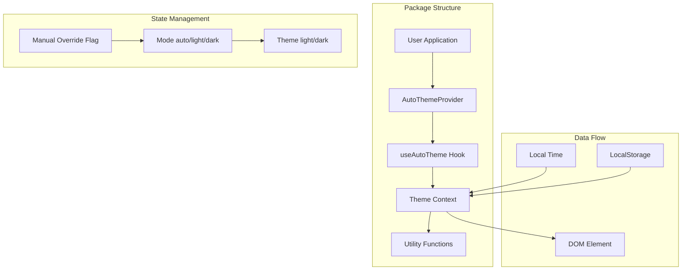

# React Auto Time Theme - Architecture Plan

## Project Overview

A lightweight React npm package for automatic time-based theme switching with manual override support.

## Architecture Diagram



## Folder Structure

```
react-auto-time-theme/
├── package.json
├── tsconfig.json
├── tsconfig.build.json
├── esbuild.config.js
├── README.md
├── src/
│   ├── index.ts
│   ├── types.ts
│   ├── constants.ts
│   ├── timeUtils.ts
│   ├── storage.ts
│   ├── AutoThemeProvider.tsx
│   └── useAutoTheme.ts
└── demo/
    ├── package.json
    ├── tsconfig.json
    ├── vite.config.ts
    ├── src/
    │   ├── App.tsx
    │   ├── main.tsx
    │   └── index.css
    └── index.html
```

## Core Components

### 1. Theme Context

The context stores:
- `mode`: "auto" | "light" | "dark"
- `theme`: "light" | "dark" (computed from mode)
- `config`: Provider configuration

### 2. State Priority System

```
Priority Order:
1. User Manual Selection (mode !== 'auto')
2. Time-based Automatic Logic (mode === 'auto')
3. Default Fallback (defaultMode)
```

### 3. Time Calculation Logic

```typescript
// Convert time to minutes from midnight
const timeToMinutes = (time: string): number => {
  const [hours, minutes] = time.split(':').map(Number);
  return hours * 60 + minutes;
};

// Check if current time is in light mode range
const isLightTime = (lightStart: string, darkStart: string): boolean => {
  const current = new Date();
  const currentMinutes = current.getHours() * 60 + current.getMinutes();
  const lightStartMinutes = timeToMinutes(lightStart);
  const darkStartMinutes = timeToMinutes(darkStart);
  
  if (lightStartMinutes < darkStartMinutes) {
    // Normal range (e.g., 07:00 to 22:00)
    return currentMinutes >= lightStartMinutes && currentMinutes < darkStartMinutes;
  } else {
    // Crosses midnight (e.g., 22:00 to 07:00)
    return currentMinutes >= lightStartMinutes || currentMinutes < darkStartMinutes;
  }
};
```

### 4. Scheduling System

Instead of setInterval, use setTimeout to schedule only the next required theme switch:

```typescript
const scheduleNextCheck = () => {
  const now = new Date();
  const currentMinutes = now.getHours() * 60 + now.getMinutes();
  const nextBoundary = getNextBoundary(currentMinutes, lightStart, darkStart);
  const msUntilBoundary = (nextBoundary - currentMinutes) * 60 * 1000;
  
  timeoutRef.current = setTimeout(() => {
    updateTheme();
    scheduleNextCheck();
  }, msUntilBoundary);
};
```

### 5. Event Handling

- `visibilitychange` event for tab focus
- Custom event for system time change (if supported)
- Cleanup on unmount

## Type Definitions

```typescript
export interface ThemeConfig {
  lightStart: string;    // "07:00"
  darkStart: string;     // "22:00"
  defaultMode: 'auto' | 'light' | 'dark';
  storageKey: string;
  applyTo: 'html' | 'body';
  onThemeChange?: (theme: Theme, mode: Mode) => void;
}

export type Theme = 'light' | 'dark';
export type Mode = 'auto' | 'light' | 'dark';

export interface ThemeContextValue {
  theme: Theme;
  mode: Mode;
  setLight: () => void;
  setDark: () => void;
  setAuto: () => void;
  toggleTheme: () => void;
}
```

## API Surface

### AutoThemeProvider Props

| Prop | Type | Default | Description |
|------|------|---------|-------------|
| lightStart | string | "07:00" | Start time for light mode |
| darkStart | string | "22:00" | Start time for dark mode |
| defaultMode | "auto" \| "light" \| "dark" | "auto" | Initial mode |
| storageKey | string | "auto-theme-mode" | LocalStorage key |
| applyTo | "html" \| "body" | "html" | Where to apply data attribute |
| onThemeChange | function | undefined | Callback when theme changes |

### useAutoTheme Return Value

| Property | Type | Description |
|----------|------|-------------|
| theme | "light" \| "dark" | Current theme |
| mode | "auto" \| "light" \| "dark" | Current mode |
| setLight | () => void | Set mode to light |
| setDark | () => void | Set mode to dark |
| setAuto | () => void | Set mode to auto |
| toggleTheme | () => void | Toggle between light and dark |

## SSR Safety Strategy

1. No window/document access during initial render
2. Theme applied on client-side mount
3. Use useEffect for DOM manipulation
4. Check for window/document existence before access

## Performance Optimizations

1. Minimal re-renders using proper context design
2. Single scheduled timeout instead of polling
3. Event listener cleanup
4. Memoized callbacks

## Demo Application

The demo app will showcase:
- Live theme preview
- Time-based switching simulation
- Manual override controls
- Configuration options
- Current time display

## Build Configuration

- **Bundler**: esbuild (ESM only)
- **TypeScript**: ES2019 target
- **Output**: ESM module format
- **Source Maps**: Yes
- **Minification**: Yes
